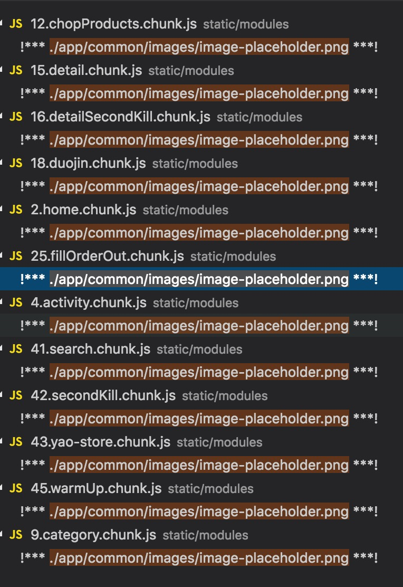
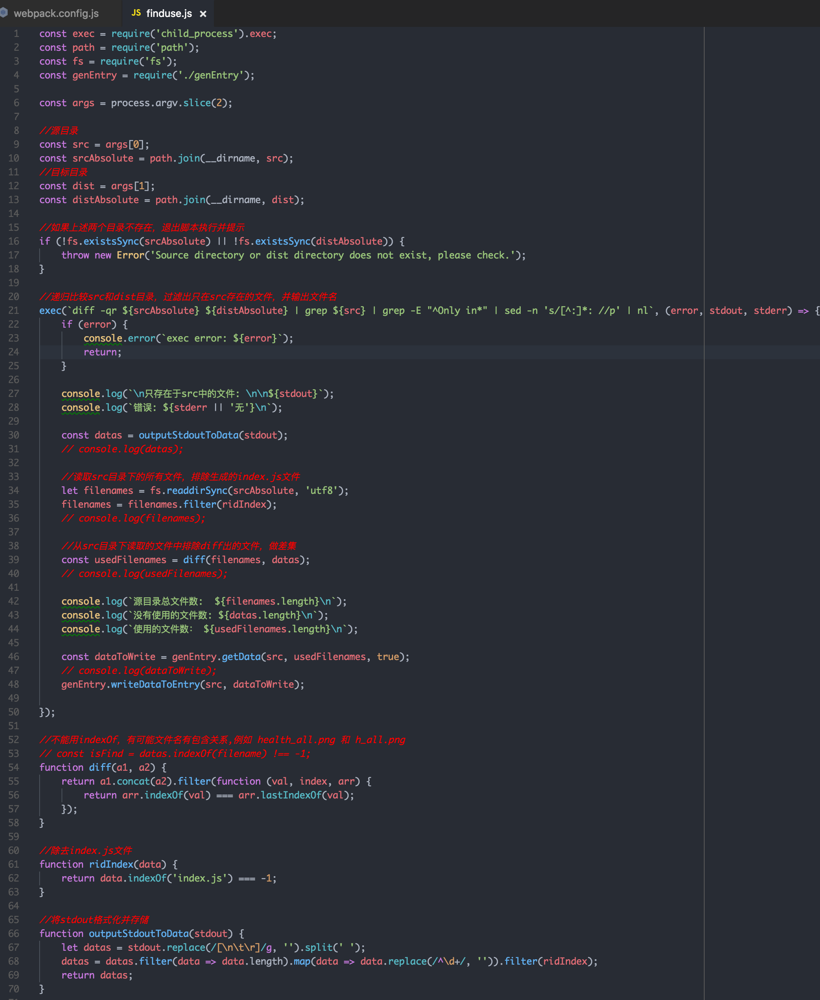
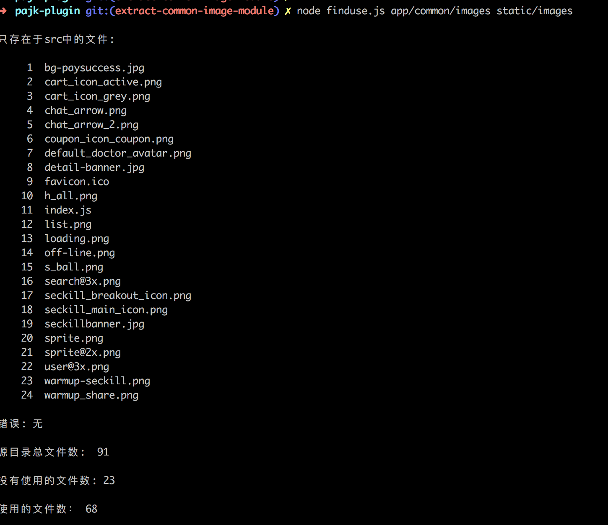
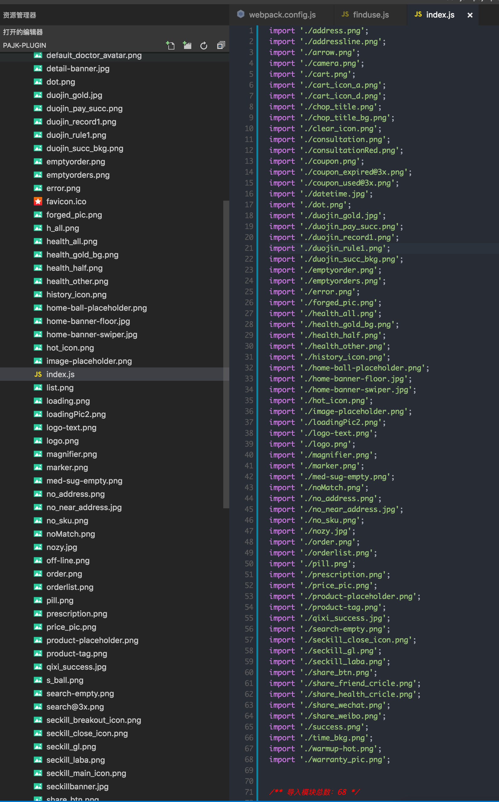
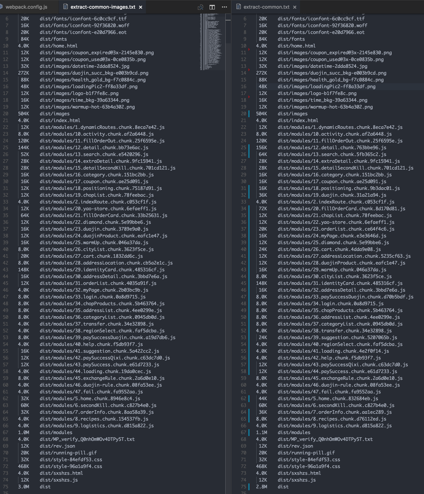

存在的问题:
webpack打包时，小于8KB的图片会被url-loader转换成base64编码放在打包后的js文件中。
但在app/common/images下的图片有很多是多个页面公用的，按照现在webpack的页面按需加载的打包方式，每个页面被打包成一个chunk.js，页面引用的公用图片也会被重复打包进各自页面的chunk.js中。
下图可见：`image-placeholder.png`这张图片被多个页面引用，结果每个页面的chunk.js中都打包了一份这个图片模块。

解决方案：通过webpack提取公共的资源到一个单独的chunk文件
步骤：
1.  修改webpack配置，在入口文件的common中添加图片资源路径 ./app/common/images

2.  由于app/common/images文件夹下有一些未被使用的图片，而且数目众多，手动查找费时费力，编写nodejs脚本，用于查找项目使用的图片，并生成index.js文件导入这些使用中的图片。
nodejs脚本文件：

3.  修改webpack的配置file-loader配置，不要将小于8KB的图片转换成base64，直接让webpack将使用的图片模块打包到static/images目录下，执行脚本，会输出app/common/images下没有被使用的图片文件：

4.  生成的index.js:

结果:

    *   通过du -ah dist查看最终打包生成的dist目录个文件和目录的大小：左侧是抽取了公共js和图片文件的dist目录各文件和目录的大小，右侧是只抽取了公共js的

    *   比只抽取公共js的dist目录大了0.2MB，首次加载的common.js文件多了200KB，其他页面各自减少若干KB（被抽取的公共图片大小）。

    *   对比未抽取公共js和图片模块的dist目录的变化为：3.7MB(未抽取公共js和图片模块) -> 2.8MB(抽取了公共js) -> 3.0MB(抽取了公共js和图片)。

    *   对于大于8K的图片，webpack打包时依旧是拷贝静态图片文件到dist/images文件夹下

